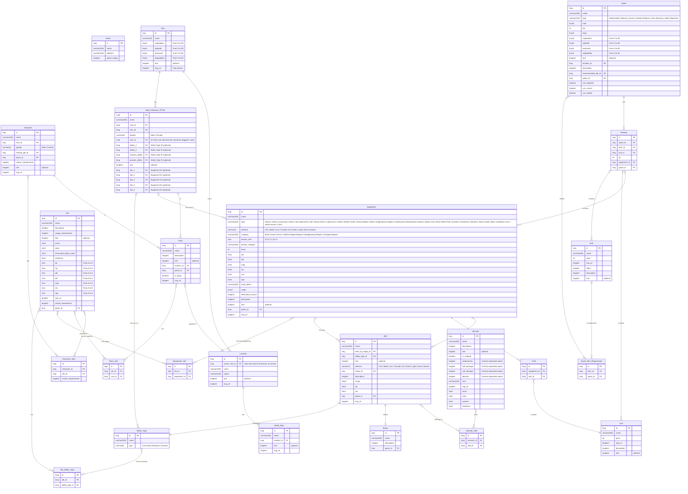

```mermaid
erDiagram
    Game {
        long id PK
        varchar(255) name
        varchar(100) platform
        longtext game_image
    }

    Character {
        long id PK
        varchar(200) name
        long race_id FK
        varchar(6) gender "Male | Female"
        long starting_job_id FK
        long game_id FK
        longtext unlock_requirements
        longtext lore "optional"
        longtext img_url
    }

    Exclusive_Jobs {
        long id PK
        long character_id FK
        long job_id FK
        longtext unlock_requirements
    }

    Race {
        long id PK
        varchar(50) name
        longtext description
        longtext lore "optional"
        long location_id FK
        long game_id FK
        boolean is_flying
        longtext img_url
    }

    Job {
        long id PK
        varchar(100) name
        longtext description
        longtext usage_requirements
        longtext lore "optional"
        short move
        short jump
        short unnarmed_attack_raise
        short resilience
        char hp "From A to H"
        char mp "From A to H"
        char atk "From A to H"
        char def "From A to H"
        char mgk "From A to H"
        char res "From A to H"
        char spd "From A to H"
        longtext img_url
        longtext unlock_requirement
        long game_id FK
    }

    Equipment_Job {
        long id PK
        long job_id FK
        long equipment_id FK
    }

    Job_Ability_Type {
        long id PK
        long job_id FK
        long ability_type_id FK
    }

    Job }o--o{ Job_Ability_Type : "has"
    Ability_Type }o--o{ Job_Ability_Type : "Can be used by"
    Job }o--o{ Equipment_Job : "Can equip"
    Equipment }o--o{ Equipment_Job : "Can be equipped by"

    Race_Job {
        logn id PK
        long job_id FK
        long race_id FK
    }

    Race }o--o{ Race_Job : "has"
    Job }o--o{ Race_Job : "can be used by"

    Character }o--o{ Exclusive_Jobs : has
    Character ||--o{ Race : is
    Job }o--o{ Exclusive_Jobs : "belongs to"

    Ability_Type {
        long id PK
        varchar(200) name
        varchar(8) type "Command | Reaction | Passive"
    }

    Status {
        long id PK
        varchar(200) name
        longtext description
        long game_id FK
    }

    Skill {
        long id PK
        varchar(200) name
        long learn_by_equip_id FK
        long ability_type_id FK
        longtext lore "optional"
        varchar(7) element "Fire | Water | Ice | Thunder | Air | Earth | Light | Dark | Neutral"
        long status_id FK
        longtext description
        tinyint range
        short ap
        short mp
        long game_id FK
        longtext img_url
    }

    Skill }o--o| Equipment : "Learns by"
    Equipment |o--o{ Skill : "Teaches"
    Skill ||--|| Ability_Type : "Belongs to"
    Skill ||--o| Status : "Inflicts"

    Clan {
        long id PK
        varchar(30) name
        tinyint negotiation "From 0 to 99"
        tinyint aptitude "From 0 to 99"
        tinyint teamwork "From 0 to 99"
        tinyint adaptability "From 0 to 99"
        longtext lore "optional"
        longtext img_url "Clan banner"
    }

    Equipment {
        long id PK
        varchar(200) name
        varchar(100) type "Shoes | Gloves | Accessory | Helm | Hair Adornment | Hat | Heavy Armor | Light Armor | Robe | Shield | Knife | Sword | Blade | Saber | Knightsword | Rapier | Greatsword | Broadsword | Katana | Spear | Axe | Rod | Staff | Pole | Knuckle | Instrument | Hammer | Mace | Book | Bow | Greatbow | Gun | Hand-cannon | Card"
        varchar(7) element "Fire | Water | Ice | Thunder | Air | Earth | Light | Dark | Neutral"
        varchar(100) category "Extra | Head | Armor | Shield | Edged Weapon | Bludgeoning Weapon | Ranged Weapon"
        char bazaar_rank "E | D | C | B | A"
        varchar(200) bazaar_category
        int price
        short atk
        short def
        short mag
        short res
        short eva
        short spd
        varchar(200) extra_effect
        tinyint range
        longtext alternative_source
        longtext description
        longtext lore "optional"
        long game_id FK
        longtext img_url
    }

    Built_Character_FFTA2 {
        uuid id PK
        varchar(100) name
        long race_id FK
        long clan_id FK
        varchar(6) gender "Male | Female"
        uuid user_id FK "Id of the user that built this character (logged in user)"
        long ability_1 FK "Ability Type ID (optional)"
        long ability_2 FK "Ability Type ID (optional)"
        long reaction_ability FK "Ability Type ID (optional)"
        long passive_ability FK "Ability Type ID (optional)"
        longtext lore "optional"
        long slot_1 FK "Equipment ID (optional)"
        long slot_2 FK "Equipment ID (optional)"
        long slot_3 FK "Equipment ID (optional)"
        long slot_4 FK "Equipment ID (optional)"
        long slot_5 FK "Equipment ID (optional)"
    }

    Built_Character_FFTA2 |o--o{ Ability_Type : "has up to 4"
    Built_Character_FFTA2 |o--o{ Equipment : "has up to 5"
    Built_Character_FFTA2 ||--o{ Race : is
    Clan ||--o{ Built_Character_FFTA2 : "has"

    Location {
        long id PK
        long owner_clan_id FK "Clan that owns this territory on auction"
        varchar(100) name
        varchar(100) region
        longtext lore "optional"
        longtext img_url
    }

    Clan ||--o{ Location : "owns"
    Race }o--o| Location : "appears in"

    Battle_Map {
        long id PK
        varchar(100) name
        long location_id FK
        longtext lore "optional"
        longtext img_url
    }

    Location ||--o{ Battle_Map : has

    Item {
        long id PK
        varchar(200) name
        int price
        longtext img_url
        longtext effect
        longtext description
        longtext lore "optional"
    }

    Quest {
        long id PK
        varchar(255) name
        varchar(100) type "Defeat Mark | Delivery | Escort | Satisfy Petitioner	| Item Recovery | Meet Objectives"
        tinyint rank
        int fee
        tinyint days
        tinyint negotiation "From 0 to 99"
        tinyint aptitude "From 0 to 99"
        tinyint teamwork "From 0 to 99"
        tinyint adaptability "From 0 to 99"
        longtext lore "optional"
        long location_id FK
        longtext description
        long recommended_job_id FK
        long game_id FK
        boolean can_dispatch
        boolean can_cancel
        boolean can_repeat
    }

    Quest_Item_Requirement {
        long id PK
        long item_id FK
        long quest_id FK
    }

    Quest }o--|{ Quest_Item_Requirement : "Needs"
    Item }|--o{ Quest_Item_Requirement : "Is required by"

    Loot {
        long id PK
        varchar(255) name
        int price
        longtext img_url
        longtext description
        longtext lore "optional"
    }

    Craft {
        long id PK
        long equipment_id FK
        long loot_id FK
    }

    Equipment ||--o{ Craft : "Needs"
    Craft }o--|| Loot : "Creates"

    Reward {
        long id PK
        long quest_id FK
        long item_id FK
        long loot_id FK
        int gil
        long equipment_id FK
        long game_id FK
    }

    Quest ||--o{ Reward : "has"
    Reward |o--o{ Item : "contains"
    Reward |o--o{ Loot : "contains"
    Reward |o--o{ Equipment : "contains"

    Monster {
        long id PK
        varchar(200) name
        longtext description
        longtext lore "optional"
        boolean is_undead
        longtext weaknesses "Comma separated values"
        longtext half_damage "Comma separated values"
        longtext null_damage "Comma separated values"
        longtext absorbs "Comma separated values"
        varchar(100) race
        longtext img_url
        short move
        short jump
        short evasion
        short resilience
    }

    Monster_Skill {
        long id PK
        long monster_id FK
        long skill_id FK
    }

    Monster }o--o{ Monster_Skill : "Uses"
    Skill }o--o{ Monster_Skill : "Belongs to"
```
